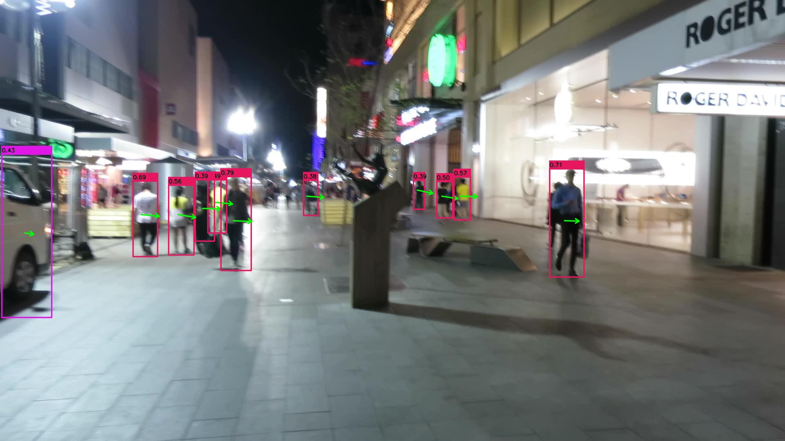

# TensorRT

---
* 1、支持OnnX的插件开发，并且实现[CenterNet](https://github.com/xingyizhou/CenterNet)的DCNv2插件demo（fp32/fp16）和Inference实现，附有案例
* 2、不建议使用pytorch->caffemodel->tensorRT，改用pytorch->onnx->tensorRT，对于任何特定需求（例如dcn、例如双线性插值），可以用插件实现
* 3、如果不用这里提供的框架，自己实现onnx插件，这里有[一份指导](README.onnx.plugin.md)，说明了关键点，可以做参考
* 4、视频讲解点击这里：https://www.bilibili.com/video/BV1Pe411x7qr


## 复现centerNetDCN的检测结果


<br/>

## 复现centerTrack的结果




## 快速使用
* 安装protobuf v3.8.x，点击[README.onnx.plugin.md](README.onnx.plugin.md)有提到怎么装
```bash
bash getDLADCN.sh
make run -j32
```

---
## 案例-Inference
```
auto engine = TRTInfer::loadEngine("models/efficientnet-b0.fp32.trtmodel");
float mean[3] = {0.485, 0.456, 0.406};
float std[3] = {0.229, 0.224, 0.225};
Mat image = imread("img.jpg");
engine->input()->setNormMat(0, image, mean, std);
engine->forward();
engine->output(0)->print();
```

## 环境-Windows
* tensorRT7.0.0.11 (如果修改为6或者其他版本，可能会面临一点改动)
* opencv3.4.6（可以任意修改为其他版本）
* cudnn7.6.3（可以任意修改为其他版本）
* cuda10.0（可以任意修改为其他版本）
* protobuf v3.8.x
* Visual Studio 2017（可以用其他版本打开，但需要修改对应opencv版本）
* <font color=red>如果要修改版本，你需要下载cuda/cudnn/tensorRT三者同时匹配的版本，因为他们互相存在依赖，否则只要你是cuda10.0就可以很轻易编译这个项目</font>
* Windows下的[依赖库lean.zip下载](http://zifuture.com:1000/fs/25.shared/lean.zip)
---


## 环境-Linux
* protobuf v3.8.x
* cuda10.2 （可以任意修改为其他版本）
* cudnn7.6.5.32-cuda10.2 （可以任意修改为其他版本）
* opencv4.2.0 （可以任意修改为其他版本）
* TensorRT-7.0.0.11 (如果修改为6或者其他版本，可能会面临一点改动)
---


## 说明
* pytorch到onnx（autograd.Function类特殊自定义实现函数导出成插件），参考[plugin_onnx_export.py](plugin_onnx_export.py)
* onnx插件MReLU参考[MReLU.cu](src/onnxplugin/plugins/MReLU.cu)，和HSwish参考[HSwish.cu](src/onnxplugin/plugins/HSwish.cu)
* src/plugin底下的插件是实现caffemodel的插件方法，与onnx不兼容，并且不被推荐使用
* int8已经失效，如果需要int8，可以使用[之前的版本并替换为tensorRT6.0](https://github.com/dlunion/tensorRTIntegrate/tree/59e933efc8011bc304d3ccd9fdd1d6cbc7b2e9a0)